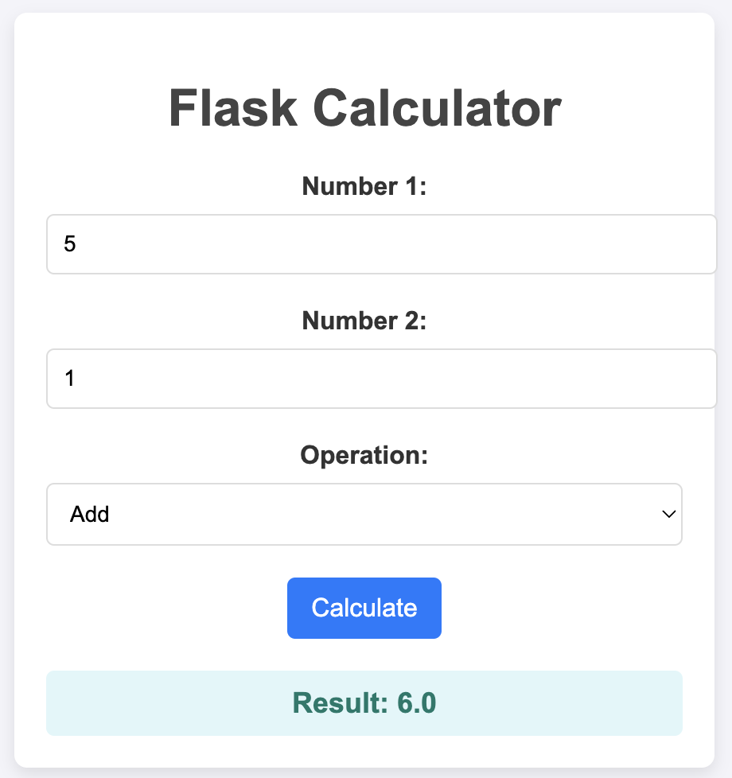
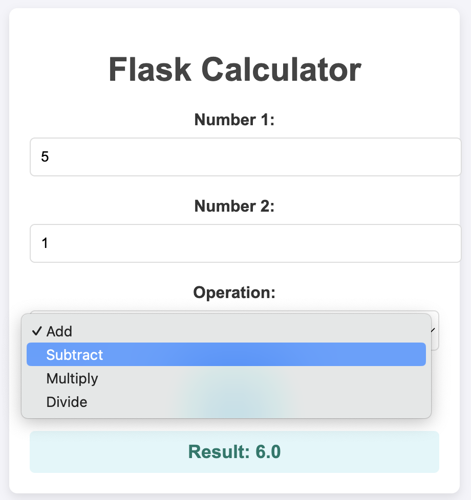

Check CI/CD Status: 

# Mini-project #12
#### Repo Title: Dockerized Application
#### Author: Seijung Kim (sk591)

## Overview
This project aims to create a simple Python calcuator application containerized with a Dockerfile. This calculator app supports Add, Subtract, Multiply, and Divide operations. The goal is to demonstrate the process of running your application within a Docker container using docker run terminal commands while also integrating containerization into a CI/CD pipeline. This pipeline automates the building, testing, and deployment of the Docker image on DockerHub. For details about how to run this project, please read the User Manual section of the README.

## Requirements/Deliverables
* Create a simple python application containerized with a dockerfile. The goal here is to both demonstrate running your application within a docker container (using docker run terminal commands) but to also build a docker image in your CI/CD pipeline which will be pushed to Docker Hub or other container management service.

## User Manual
1. Make sure both Flask and Docker are installed. You can check using `python -m flask --version` and `docker --version`. Also clone the repository to your local machine using `git clone <URL>`

2. Navigate to the project directory and build the Docker image using `make build`. This command will use the Dockerfile to create an image tagged to `de_project12`.

3. Run the application in the Docker container with `make run`

4. The Flask app will be accessible now. Access the app via: http://127.0.0.1:80 When the app is running inside a Docker container: http://127.0.0.1:8000. Test the calculator by giving two input numbers and choosing one of the operations: Add, Subtract, Multiply, and Divide.

5. You can now push the Docker image to Docker Hub. Login to Docker Hub with this command `docker login`

6. Tag and push the image to Docker Hub using `make push`

## Screenshots of Dockerized App

